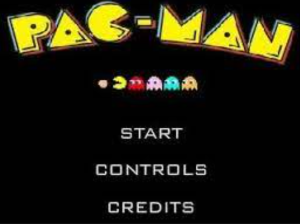
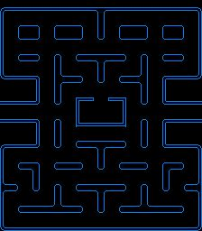
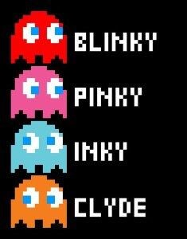
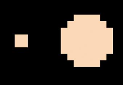
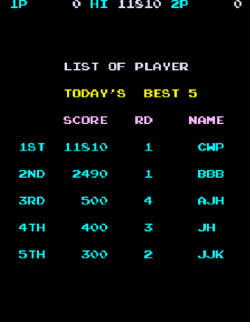
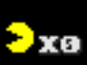
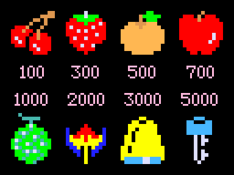
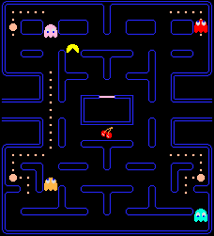
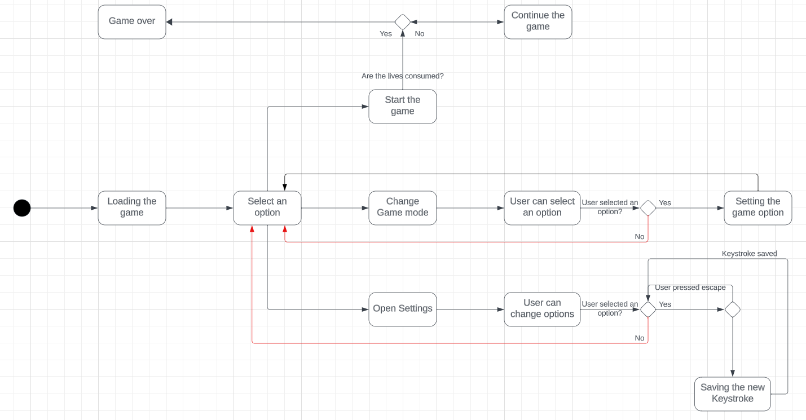

# Functional Specification Document

## x86-16bits Retro-gaming

- [Functional Specification Document](#functional-specification-document)
  - [x86-16bits Retro-gaming](#x86-16bits-retro-gaming)
  - [Project Overview](#project-overview)
  - [Project Scope](#project-scope)
      - [Project in scope](#project-in-scope)
      - [Project out of scope](#project-out-of-scope)
  - [Project Goals](#project-goals)
      - [Goals](#goals)
      - [Non-Goals](#non-goals)
  - [Functional Requirements](#functional-requirements)
    - [1. x86-16bits environment](#1-x86-16bits-environment)
      - [Description](#description)
      - [Acceptance Criteria](#acceptance-criteria)
    - [2. Pac-Man](#2-pac-man)
      - [Description](#description-1)
        - [Acceptance Criteria](#acceptance-criteria-1)
      - [2.1 Main menu](#21-main-menu)
      - [2.2 Start](#22-start)
      - [2.3 Game over](#23-game-over)
      - [2.4 Settings in menu](#24-settings-in-menu)
      - [2.5 Credits](#25-credits)
      - [2.6 Map](#26-map)
      - [2.7 Pac-Man](#27-pac-man)
      - [2.8 Collisions/Hitboxes](#28-collisionshitboxes)
      - [2.9 Enemies](#29-enemies)
      - [2.10 Pellets \& Power Pellets](#210-pellets--power-pellets)
      - [2.11 Score](#211-score)
      - [2.12 Bonus](#212-bonus)
      - [2.13 Lives](#213-lives)
    - [Sprites](#sprites)
  - [Non-Functional Requirements](#non-functional-requirements)
    - [1. Game Mode](#1-game-mode)
    - [2. Game Settings](#2-game-settings)
  - [Use Cases](#use-cases)
    - [Personae](#personae)
  - [Design](#design)
  - [Assumptions \& Constraints](#assumptions--constraints)
    - [Assumptions](#assumptions)
    - [Constraints](#constraints)
  - [Risks](#risks)
  - [Glossary](#glossary)

---


| **Member of the project** ||
|:-|:-|
| Name | Role |
| Guillaume DESPAUX | Project Manager |
| Michel RIFF | Program Manager |
| Lucas AUBARD | Technical Lead |
| Enzo GUILLOUCHE | Junior Software Engineer |
| Elone DELILLE | Junior Software Engineer |
| Ian LAURENT | Quality Assurance |


## Project Overview

ALGOSUP asked us to recreate an old video game, which is the game called "Pac-Man". We will make it with some features, in an environment called MS-DOS [^1] (x86-16bits) and in assembly language [^2].
This project debuted on Monday the 6th of November, and its deadline is Thursday the 21st of December 2023.

---
Pac-Man overview.


Pac-Man is a game created in 1980 in Japan, it's a single-player video game where the player takes control of a yellow character also known as Pac-Man, where the player's goal will be to collect all the points represented as pellets in a Maze. This yellow character is followed by ghosts whose main goal is to catch Pac-man. If Pac-Man gets caught by a ghost the game pauses and both Pac-Man and the ghosts return to their initial starting points. Pac-man has three lives and if he loses all three lives the game ends and the points are lost. In the Game there are some features such as "super points" which are distinguished on the map with a larger pellet, this points will allow Pac-Man to be the one chasing the ghosts and allow him to win more points if he manages to catch one or more.

## Project Scope

#### Project in scope

- To define the core gameplay mechanics, rules, and objectives for the Pac-Man game, including the movement of the Pac-Man character, the behavior of ghosts and scoring by collecting pellets.
- To set performance goals, such as achieving a target frame rate and ensuring smooth gameplay.

#### Project out of scope

- To create the game that has another objective of the main game.
- To create the game in another language than assembly. 
- To develop the game that does not work/launch.

## Project Goals

#### Goals
- Allows the player to select the apparence of the caracter.
- To implement music.
- To give the possibility to change the difficulty or the game mode in the settings.
- To create new maps.
- To make the game smooth and playable.
- To make a compatible game with all the Operating Systems [^3].

#### Non-Goals
- Implementing levels with a "Boss" for a more challenging level

## Functional Requirements

### 1. x86-16bits environment

#### Description

For this project we were asked to use the software DOSBox [^4] which is a simulator of the MS-DOS environment. In addition to DOSBox, NASM [^5] was part of the initial requirement.

#### Acceptance Criteria

- The final product must run on this software in order for it to be valid.
- The DOSBox emulator will have to integrated into an installer which will ease the download of the final product.

### 2. Pac-Man

#### Description

We need to create a game which contains the same mechanics of gameplay than the game Pac-Man, since the copyrights are no longer a problem, we can use the same sprites and musics. 

##### Acceptance Criteria

- The final product must not have any issues, crashes, system failures, or glitches throughout the whole user's experience.

#### 2.1 Main menu
The main menu is the first page that you land on when you launch the game. This page allows the player to either play or to access to the settings. 

#### 2.2 Start
Once the game starts, the player will be able to play until he loses all his lives.

#### 2.3 Game over
If the player loses all his lives, he will be redirected to the main menu.

#### 2.4 Settings in menu
The settings will be accessible from the main menu, which will allow the user to customize the key binds.

#### 2.5 Credits
The credits are accessible from the main menu, they serve to credit the people who worked on the project, from close or far.

#### 2.6 Map
The map is an environment in which the player moves up and down, left and right, while eating pellets and avoiding the ghosts that try to catch them. It contains several labyrinth-like walls that test the player's speed of execution.

#### 2.7 Pac-Man
The player will have the possibility to control the movements of the yellow character known as Pac-Man in the maze, the player will have control over the 4 directions (up, down, left, and right).

#### 2.8 Collisions/Hitboxes 
In Pac-Man, the payable character has hitboxes[^6] with the map, the objects he can interact with, the enemies. 

#### 2.9 Enemies 
The enemies are the 4 ghosts in the game, each has a special color to discern it from the others. Their goal is to follow Pac-Man and catch him, and each ghost has its own pattern[^7].

| Ghosts | Name |
|:-|-:|
||Blinky|
||Pinky|
||Inky|
||Clyde|

#### 2.10 Pellets & Power Pellets
The pellets are the points that Pac-Man eats during the game. The player has to eat all of them to success the level and increase the score. The power pellets make the ghosts vulnerable. There are 244 pellets and 4 power pellets.

#### 2.11 Score
The score is displayed on the screen, for each pellet that Pac-Man eats, the player's score will increase by 10 points, for each power pellet the player will increase its score by 30 points. As for the ghosts, every time a player eats a power pellet and catches a ghost, the player's score will increase by 200, depending on the number of ghosts the player catches in their vulnerable state. Every ghost that will be caught, will allow the player to gain more points every time. The highest score of the previous games will be displayed next to the game score which will allow the player to see its progression from the previous games.

#### 2.12 Bonus
In Pac-Man, the bonus is the objects that appear on the map, which they allow to earn points every time Pac-Man eats it.

#### 2.13 Lives
The lives are the chances that the player has to complete the game, when the player launches the game he will initially have 3 lives, everytime that Pac-Man gets caught by a ghost he loses one life and returns to the original position keeping he's score and the progression on the map. Everytime the player reaches 10 thousand points the player will be rewarded with an extra life. If the player runs out of lives the game will be over and he will have to start the game over.

### Sprites
| Name | Sprite |
| :--- | ---: |
| Main menu |  |
| Map |  |
| Pac-Man |  |
| Ghosts |  |
| Pellet and power pellet |  |
| High-score |  |
| Lives |  |
| Bonus |  | 

---

Here is a general idea of what the final product will look like :




## Non-Functional Requirements

### 1. Game Mode

**Different game modes :**

- Multiplayer game mode:
  
  This game mode is based on a two player version, The first player will be able to control Pac-Man, the other player will have the possibility to take control of one of the ghosts this players goal will be, Pac-Man whom is controled by the first player. Both players control will have control of their characters with the same keyboard with different control keys.

- Reverse game mode:
  
  In this game mode, the player takes control of the red ghost with the goal of catching Pac-Man with the three other ghosts. Pac-Man will have three lives as just like the original game and it will have its own pattern. The player will win if Pac-Man has no lives left but he loses if it eats all the pellets.

- Timed game mode:
  
  This game mode is like the original one version but with a limited time. This time limit will decrease as the player goes up a level.
  
### 2. Game Settings

- Music : Possibility of switching on/off the music of the game.
- Sound effect : Possibility of switching on/off the sound effects of the game.
- Character : Possibility to select one of the available skins available in the game.
- Keybind : Possibility to configure the keybinds as the player want.
  - Default keybinds for the first player moves :
    - **Up Arrow**: Move the Pac-Man character upward.
    - **Down Arrow**: Move the Pac-Man character downward.
    - **Left Arrow**: Move the Pac-Man character to the left.
    - **Right Arrow**: Move the Pac-Man character to the right.


When the player launch the game, he will be asked if he want to play with AZERTY or QWERTY keyboard :
  - Default keybinds for the second player moves (if AZERTY keyboard) :
    - **Z**: Move the Ghost character upward.
    - **S**: Move the Ghost character downward.
    - **Q**: Move the Ghost character to the left.
    - **D**: Move the Ghost character to the right.
  
  - Default keybinds for the second player moves (if QWERTY keyboard) :
    - **W**: Move the Ghost character upward.
    - **S**: Move the Ghost character downward.
    - **A**: Move the Ghost character to the left.
    - **D**: Move the Ghost character to the right.

## Use Cases

### Personae

**First user:**
```
Name: Carl Johnson 

Background: Carl is a casual gamer who enjoys classic arcade games. He has limited technical knowledge but is enthusiastic about playing games for relaxation and entertainment.

Goals and Motivations: 
-Wants an engaging and nostalgic gaming experience.
-Prefers simple controls and intuitive gameplay.
-Enjoys challenges but expects the game to be fair.
```

**Second user:**
```
Name: Trevor Philips

Background: Trevor is an avid gamer with extensive experience playing a variety of video games, including classic arcade games like Pac-Man. They are well-versed in gaming mechanics, strategies, and appreciate a good challenge.

Goals and Motivations:
-Seeks a Pac-Man game that offers a challenging and competitive experience.
-Likes to discover different versions of popular games.
-Desires a game that provides a sense of accomplishment and mastery.
```

## Design

Here is the UML case diagram from the users' point of view, grouping the basic functionalities of the supposedly final product.



## Assumptions & Constraints

### Assumptions
- The game will be available to download on GitHub and once the game installed, the game will be able to run without the need to be connected to the internet.
- This game will be available to be download from Google Drive.
### Constraints
- The game has to run on DOSBox. 

## Risks

- Not being able to deliver the final product on due date.
- The final product not working on the customer's device.
- To not credit regarding the copyrights.
- The game interactions such as game control or opening menu not functioning.
- Going over the limit of 16 bits.
- Customer not satisfied with the final product.

## Glossary

[^1]: MS-DOS is an Operating System for x86-based PCs mostly developed by Microsoft.

[^2]:  Assembly language is a low-level programming language that is used to write programs for a computer's central processing unit (CPU). It is a human-readable representation of machine code making it easier for programmers to write and understand low-level code while still having a one-to-one correspondence with the actual machine code.

[^3]: An Operating System (OS) is the low-level software that supports a computer's basic functions, such as scheduling tasks and controlling peripherals.

[^4]: DOSBox is a simulator of the MS-DOS environment. 

[^5]: The Netwide Assembler (NASM) is an assembler and disassembler for the Intel x86 architecture. It can be used to write 16-bit, 32-bit (IA-32) and 64-bit (x86-64) programs.

[^6]: A hitbox is an invisible shape bounding all or part of a model (in a video game, etc.) used in collision detection to determine whether another object collides with the model.

[^7]: In software engineering, a pattern is a reusable behavior of a Non-Playable Character (NPC), which can be overuse by the player to beat a boss for example.


