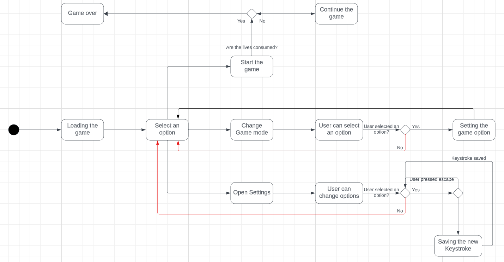

# Functional Specification Document

## x86x16bits Retro-gaming

- [Functional Specification Document](#functional-specification-document)
  - [x86x16bits Retro-gaming](#x86x16bits-retro-gaming)
  - [Project Overview](#project-overview)
  - [Project Scope](#project-scope)
      - [Project in scope](#project-in-scope)
      - [Project out of scope](#project-out-of-scope)
  - [Project Goals](#project-goals)
      - [Goals](#goals)
      - [Non-Goals](#non-goals)
  - [Functional Requirements](#functional-requirements)
    - [1. x86-16bits environment](#1-x86-16bits-environment)
      - [Description](#description)
      - [Acceptance Criteria](#acceptance-criteria)
    - [2. Pac-Man like](#2-pac-man-like)
      - [Description](#description-1)
        - [Acceptance Criteria](#acceptance-criteria-1)
      - [2.1 Main menu](#21-main-menu)
      - [2.2 Start](#22-start)
      - [2.3 Game over](#23-game-over)
      - [2.4 "Control" menu as the settings](#24-control-menu-as-the-settings)
      - [2.5 Credits](#25-credits)
      - [2.6 Map](#26-map)
      - [2.7 Pac-Man](#27-pac-man)
      - [2.8 Collisions/Hitboxes](#28-collisionshitboxes)
      - [2.9 Enemies](#29-enemies)
      - [2.10 Dots](#210-dots)
      - [2.11 Score](#211-score)
      - [2.12 Bonus](#212-bonus)
      - [2.13 Lives](#213-lives)
    - [Sprites](#sprites)
  - [Non-Functional Requirements](#non-functional-requirements)
    - [1. Game mode](#1-game-mode)
    - [2. Options in the game](#2-options-in-the-game)
  - [Use Cases](#use-cases)
    - [Personas](#personas)
  - [Design](#design)
  - [Assumptions and Constraints](#assumptions-and-constraints)
    - [Assumptions](#assumptions)
    - [Constraints](#constraints)
  - [Risks](#risks)
  - [Glossary](#glossary)

---


**| Member of the project |**

| Name | Role |
| :--- | ---: |
| Guillaume DESPAUX | Project Manager
| Michel RIFF | Program Manager
| Lucas AUBARD | Technical Lead
| Enzo GUILLOUCHE | Junior Software Engineer
| Elone DELILLE | Junior Software Engineer
| Ian LAURENT | Quality Assurance


## Project Overview

ALGOSUP asked us to recreate an old video game, which is the game called "Pac-Man". We will make it with some features, in an environment called MS-DOS (x86-16bits) and in assembly language [^1].
This project started on Monday November 6th and its deadline is on Thursday December 21st.

---
 So what is Pac-Man ? 


Pac-Man is a maze-based and a single player video game set in a brightly colored, released in 1980 in Japan. The player takes control of a yellow character, known as Pac-Man. The objective of the game is to clear all the dots from the maze while avoiding four colorful ghosts who are out to catch Pac-Man. The player earns points by consuming dots and, occasionally, larger dots, which temporarily turn the ghosts vulnerable, then Pac-Man can eat them to earn more points.


## Project Scope

#### Project in scope

- To define the core gameplay mechanics, rules, and objectives for the Pac-Man game, including the movement of the Pac-Man character, the behavior of ghosts and collecting pellets.
- To set performance goals, such as achieving a target frame rate and ensuring smooth gameplay.

#### Project out of scope

- To create the game that has another objective of the main game.
- To create the game in another language than assembly. 
- To develop the game that does not work/launch.

## Project Goals

#### Goals
- To change the playable character
- To change the music
- To give the possibility to change the difficulty
- To create new maps
- To make the game smooth and playable
- To make a compatible game

#### Non-Goals
- To add boss stages
- To add new game mode

## Functional Requirements

### 1. x86-16bits environment

#### Description

For this project we need to use the software DOSBox which is a simulator of a MS-DOS environment.

#### Acceptance Criteria

- Each system will have to use this software to play the game.
- The DOSBox emulator will be integrated into an installer, supplied when we will be going to bring out this game. 

### 2. Pac-Man like

#### Description

We need to create a game which contains the same mechanics of gameplay than the game Pac-Man, using new models and soundtracks due to copyright. 

##### Acceptance Criteria

- The game must be complete with no issue, crash, bug or glitch during all the user experience.

#### 2.1 Main menu
The main menu is the menu you land on when you launch the game. It allows the player to choose to play, to change his controls in the settings. 

#### 2.2 Start
The game starts and the player can play until he loses all his lives.

#### 2.3 Game over
If the player loses all his lives, it's game over, then he comes back to the main menu.

#### 2.4 "Control" menu as the settings
The settings are accessible from the main menu, it must to change the player's key binds as he would like. 

#### 2.5 Credits
The credits are accessible from the main menu, they serve to credit the people who worked on the project, from close or far.

#### 2.6 Map
When the player starts the game, it will take place in a map. The whole map deals with all the maze, and it will all be displayed on the screen. 

#### 2.7 Pac-Man
The famous character Pac-Man is the playable one in the game. The player who controls him can change his direction, while he's moving, in 4 directions (up, left, right and down), he also can eat dots by just going on them.

#### 2.8 Collisions/Hitboxes 
In Pac-Man, the payable character has hitboxes[^2] with the map, the objects he can interact with, the enemies. 

#### 2.9 Enemies 
The enemies are the 4 ghosts in the game, each has a special color to discern it from the others. Their goal is to follow Pac-Man and catch him, and each ghost has its own pattern[^3].

#### 2.10 Dots
The dots are the points that Pac-Man eats during the game. The player has to eat all of them to success the level and increase the score. The power pellets make the ghosts vulnerable. There are 244 dots and 4 power pellets (located on the corners of the map).

#### 2.11 Score
The score shows the points the player earned during the game. The little dots earn 10 points, the power pellets earn 30 points, when the player eats a vulnerable ghost, he earns 200 points; and a bonus earns from 100 points to 5000. A highscore can be displayed on the screen, the player could want to beat it. 


#### 2.12 Bonus
In Pac-Man, the bonus are the objects which appear on the map, they just earn points.

#### 2.13 Lives
The lives are the chances the player has to beat the game. If he has no lives anymore, it's game over. If the player earns 10,000 points, he gets another life.

### Sprites
| Name | Sprite |
| :--- | ---: |
| Main menu |  |
| Map |  |
| Pac-Man |  |
| Ghosts |  |
| Dots |  |
| High-score |  |
| Lives |  |
| Bonus |  | 

This is how the game would looke like:


## Non-Functional Requirements

### 1. Game mode

**Differents game modes :**

- Multiplayer game mode:
  
  This game mode is based on two player, one control Pac-Man with the original objective, the other player takes control of one of the ghosts and has the objective to catch the other player accompanied with the other ghosts. Both players control their character with the same keyboard.

- Reverse game mode:
  
  In this game mode, the player takes control of the red ghost and has the objective to catch Pac-Man accompanied with the three other ghosts. Pac-Man has three lives as the original game and it has its own pattern. The player wins if Pac-Man has no lives left but he loses if it eats all the dots.

- Timed game mode:
  
  This game mode is like the original one but with a limited time determined which is reduced further the player wins level.
  
### 2. Options in the game

**Settings in the game:**
- Music : Give the possibility to put on/off the music of the game.
- Sound effect : Give the possibility to put on/off the sound effect of the game.
- Character : Give the possibility to select one of the available skin implemented in the game.
- Keybind : Give the possibility to configure the keybinds as the player want. 


## Use Cases

### Personas

**First user:**
```
Name: Carl Johnson 

Background: Carl is a casual gamer who enjoys classic arcade games. He has limited technical knowledge but is enthusiastic about playing games for relaxation and entertainment.

Goals and Motivations: 
-Wants an engaging and nostalgic gaming experience.
-Prefers simple controls and intuitive gameplay.
-Enjoys challenges but expects the game to be fair.
```

**Second user:**
```
Name: Trevor Philips

Background: Trevor is an avid gamer with extensive experience playing a variety of video games, including classic arcade games like Pac-Man. They are well-versed in gaming mechanics, strategies, and appreciate a good challenge.

Goals and Motivations:
-Seeks a Pac-Man game that offers a challenging and competitive experience.
-Enjoys discovering easter eggs and hidden features in games.
-Desires a game that provides a sense of accomplishment and mastery.
```

## Design

Here's a description of what the game would look like in the player's sight. 



## Assumptions and Constraints

### Assumptions
- The game would be download, it would run without any Internet connection. 
### Constraints
- The game has to run on DOSBox. 

## Risks

- Not deliver the final product on time.
- Make the game not working/launching on the customer's hardware.
- To not credit regarding the copyrights. 

## Glossary

[^1]:  Assembly language is a low-level programming language that is used to write programs for a computer's central processing unit (CPU). It is a human-readable representation of machine code making it easier for programmers to write and understand low-level code while still having a one-to-one correspondence with the actual machine code.

[^2]: A hitbox is an invisible shape bounding all or part of a model (in a video game, etc.) used in collision detection to determine whether another object collides with the model.

[^3]: In software engineering, a pattern is a reusable behavior of a Non-Playable Character (NPC), which can be overuse by the player to beat a boss for example.
