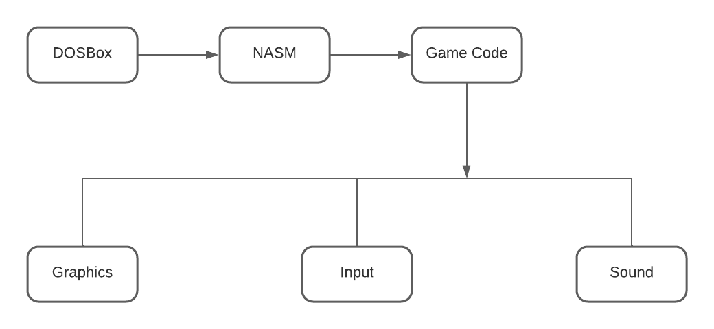

# Pac-Man Game Technical Specification

## Team Members

| Name               | Role                  | Responsibilities                   |
|--------------------|-----------------------|-------------------------------------|
| Guillaume DESPAUX    | Project Manager        | Project Planning, Resource Allocation, Stakeholder Communication, Risk Management                        |
| Michel RIFF          | Program Manager        | Program-level Planning, Alignment with Business Goals, Cross-Team Coordination                           |
| Lucas AUBARD         | Technical Leader       | System Architecture, Game Engine, Overall Technical Oversight, Coordination with Team Members            |
| Enzo GUILLOUCHE      | Software Engineer      | Code Implementation, Code Review                                                                         |
| Elone DELILLE        | Software Engineer      | Code Implementation, Code Review                                                                         | 
| Ian LAURENT          | QA/Test Engineer       | Testing Strategy, Test Case Design, Debugging Support, Performance Testing                               |

## Table of Contents
- [Pac-Man Game Technical Specification](#pac-man-game-technical-specification)
  - [Team Members](#team-members)
  - [Table of Contents](#table-of-contents)
  - [1. Introduction](#1-introduction)
    - [1.1 Purpose](#11-purpose)
    - [1.2 Scope](#12-scope)
  - [2. System Architecture](#2-system-architecture)
    - [2.1 High-Level Overview](#21-high-level-overview)
    - [2.2 Block Diagram](#22-block-diagram)
  - [3. Game Components](#3-game-components)
    - [3.1 Graphics Module](#31-graphics-module)
      - [3.1.1 Overview](#311-overview)
      - [3.1.2 Functionalities](#312-functionalities)
      - [3.1.3 Graphics Architecture](#313-graphics-architecture)
    - [3.2 Input Handling](#32-input-handling)
      - [3.2.1 Overview](#321-overview)
      - [3.2.2 Functionalities](#322-functionalities)
      - [3.2.3 Input Flow](#323-input-flow)
    - [3.3 Game Logic](#33-game-logic)
      - [3.3.1 Overview](#331-overview)
      - [3.3.2 Functionalities](#332-functionalities)
      - [3.3.3 Interaction with Other Components](#333-interaction-with-other-components)
      - [3.3.4 Game State Management](#334-game-state-management)
  - [4. Assembly Language and NASM](#4-assembly-language-and-nasm)
    - [4.1 Choice of Assembly Language](#41-choice-of-assembly-language)
      - [4.1.1 Selection](#411-selection)
      - [4.1.2 Justification](#412-justification)
    - [4.2 NASM Assembly](#42-nasm-assembly)
      - [4.2.1 Overview](#421-overview)
      - [4.2.2 NASM Directives](#422-nasm-directives)
      - [4.2.3 NASM Settings](#423-nasm-settings)
      - [4.2.4 Linking](#424-linking)
      - [4.2.5 Code Structure](#425-code-structure)
      - [4.2.6 Comments and Documentation](#426-comments-and-documentation)
  - [5. Development Environment](#5-development-environment)
    - [5.1 DOS Environment](#51-dos-environment)
      - [5.1.1 Configuration](#511-configuration)
      - [5.1.2 DOS Version](#512-dos-version)
    - [5.2 DOSBox Configuration](#52-dosbox-configuration)
      - [5.2.1 Installation](#521-installation)
      - [5.2.2 Configuration Settings](#522-configuration-settings)
      - [5.2.3 Autoexec Configuration](#523-autoexec-configuration)
    - [5.3 Development Tools](#53-development-tools)
      - [5.3.1 Text Editor](#531-text-editor)
      - [5.3.2 NASM Assembler](#532-nasm-assembler)
      - [5.3.3 Linker](#533-linker)
    - [5.4 Version Control](#54-version-control)
      - [5.4.1 Git](#541-git)
      - [5.4.2 GitHub](#542-github)
  - [6. Testing and Debugging](#6-testing-and-debugging)
    - [6.1 Testing Strategies](#61-testing-strategies)
      - [6.1.1 Integration Testing](#611-integration-testing)
      - [6.1.2 System Testing](#612-system-testing)
    - [6.2 Debugging Tools](#62-debugging-tools)
      - [6.2.1 DOS Debug](#621-dos-debug)
      - [6.2.2 NASM Debugger](#622-nasm-debugger)
      - [6.2.3 Turbo Debugger](#623-turbo-debugger)
    - [6.3 Performance Optimization](#63-performance-optimization)
      - [6.3.1 Profiling](#631-profiling)
      - [6.3.2 Code Optimization](#632-code-optimization)
    - [6.4 Security Measures](#64-security-measures)
      - [6.4.1 Code Review](#641-code-review)
  - [7. Performance Considerations](#7-performance-considerations)
    - [7.1 Graphics Rendering Optimization](#71-graphics-rendering-optimization)
      - [7.1.1 Sprite Rendering Efficiency](#711-sprite-rendering-efficiency)
    - [7.2 Input Handling Efficiency](#72-input-handling-efficiency)
      - [7.2.1 Input Buffering](#721-input-buffering)
      - [7.2.2 Input Debouncing](#722-input-debouncing)
    - [7.3 Game Logic Optimization](#73-game-logic-optimization)
      - [7.3.1 Algorithmic Efficiency](#731-algorithmic-efficiency)
      - [7.3.2 Level Loading](#732-level-loading)
    - [7.4 Memory Management](#74-memory-management)
      - [7.4.1 Dynamic Memory Allocation](#741-dynamic-memory-allocation)
      - [7.4.2 Resource Caching](#742-resource-caching)
    - [7.5 Code Efficiency](#75-code-efficiency)
      - [7.5.1 Code Profiling](#751-code-profiling)
      - [7.5.2 Code Refactoring](#752-code-refactoring)
  - [8. User Interface Design](#8-user-interface-design)
    - [8.1 Game Screen Layout](#81-game-screen-layout)
      - [8.1.1 Player Information](#811-player-information)
      - [8.1.2 Game Grid](#812-game-grid)
    - [8.2 Player Controls](#82-player-controls)
      - [8.2.1 Keyboard Input](#821-keyboard-input)
      - [8.2.2 Additional Controls](#822-additional-controls)
    - [8.3 Visual Feedback](#83-visual-feedback)
      - [8.3.1 Pac-Man Animation](#831-pac-man-animation)
      - [8.3.2 Ghost Behaviors](#832-ghost-behaviors)
    - [8.4 Audio Feedback](#84-audio-feedback)
      - [8.4.1 Sound Effects](#841-sound-effects)
      - [8.4.2 Background Music](#842-background-music)
    - [8.5 Menus and Screens](#85-menus-and-screens)
      - [8.5.1 Start Screen](#851-start-screen)
      - [8.5.2 Pause Menu](#852-pause-menu)
      - [8.5.3 Game Over Screen](#853-game-over-screen)
    - [8.6 Accessibility Considerations](#86-accessibility-considerations)
      - [8.6.1 Textual Feedback](#861-textual-feedback)
      - [8.6.2 Keyboard Navigation](#862-keyboard-navigation)
  - [9. Game Logic and Mechanics](#9-game-logic-and-mechanics)
    - [9.1 Pac-Man Movement](#91-pac-man-movement)
      - [9.1.1 Grid-Based Movement](#911-grid-based-movement)
      - [9.1.2 Directional Constraints](#912-directional-constraints)
    - [9.2 Pellets and Power-Ups](#92-pellets-and-power-ups)
      - [9.2.1 Pellet Consumption](#921-pellet-consumption)
      - [9.2.2 Power-Up Effects](#922-power-up-effects)
    - [9.3 Ghost Behavior](#93-ghost-behavior)
      - [9.3.1 Patrol and Chase Modes](#931-patrol-and-chase-modes)
      - [9.3.2 Ghost Movement Algorithms](#932-ghost-movement-algorithms)
    - [9.4 Game Over Conditions](#94-game-over-conditions)
      - [9.4.1 Lives and Respawns](#941-lives-and-respawns)
      - [9.4.2 Game Over Screen](#942-game-over-screen)
    - [9.5 Scoring System](#95-scoring-system)
      - [9.5.1 Point Values](#951-point-values)
      - [9.5.2 Level Progression](#952-level-progression)
    - [9.6 Game Progression](#96-game-progression)
      - [9.6.1 Level Transitions](#961-level-transitions)
      - [9.6.2 Game Completion](#962-game-completion)
  - [10. Documentation](#10-documentation)
    - [10.1 Code Comments](#101-code-comments)
      - [10.1.1 Function-Level Comments](#1011-function-level-comments)
      - [10.1.2 Algorithmic Comments](#1012-algorithmic-comments)
  - [11. Future Enhancements](#11-future-enhancements)
    - [11.1 Compatibility Updates](#111-compatibility-updates)
      - [11.1.1 DOSBox Updates](#1111-dosbox-updates)
      - [11.1.2 NASM Updates](#1112-nasm-updates)
  - [12. Conclusion](#12-conclusion)

## 1. Introduction

### 1.1 Purpose
This document outlines the technical details for the development of an enhanced Pac-Man game in Assembly language, leveraging DOSBox and NASM. The project aims to create a modernized version of the classic Pac-Man experience, incorporating additional features and forgoing the creation of a bespoke game engine.

### 1.2 Scope
The Pac-Man game will be a reimagination that captures the essence of the original while introducing new elements to enhance gameplay. Key aspects of the project include:

- **Game Features:** The focus will be on expanding gameplay with new features, challenges, and possibly additional levels, elevating the user experience beyond the classic Pac-Man.

- **Graphics:** The graphics subsystem will be tailored to deliver an updated visual experience while preserving the iconic Pac-Man aesthetic.

- **Input Handling:** User input will be seamlessly integrated to control Pac-Man's movements, embracing a responsive and intuitive design.

- **Game Logic:** Algorithms governing Pac-Man's behavior, ghost movement, scoring, and level progression will be refined to accommodate the new features.

- **NASM and DOSBox:** The development will utilize NASM for low-level programming, and the game will run in a DOS environment using DOSBox, providing a nostalgic yet compatible platform.

The scope also includes:

- **Development Environment:** Establishment of a suitable DOS environment and configuration of DOSBox to ensure optimal performance and compatibility.

- **Testing and Debugging:** Robust testing and debugging strategies, with an emphasis on integration testing and the use of appropriate debugging tools.

- **Performance Considerations:** Strategies for optimization, resource usage, and responsiveness to enhance the overall gaming experience.

- **Security Measures:** Implementation of input validation to fortify the game against potential vulnerabilities.

- **User Interface:** Definition of an engaging user interface, encompassing the game display layout, controls, and other relevant aspects.

- **Documentation:** Comprehensive documentation standards within the code and in external documentation, ensuring clarity and ease of understanding.

The project aims to deliver a captivating and feature-rich Pac-Man game that not only respects the classic gameplay but introduces innovative elements to captivate modern audiences.
s

## 2. System Architecture

### 2.1 High-Level Overview
The system architecture is designed to accommodate the enhanced Pac-Man game, emphasizing modularity and extensibility. The architecture comprises several interconnected components responsible for delivering a seamless gaming experience.

The high-level overview includes:

- **Game Core:** This central module encapsulates the core functionalities of the Pac-Man game, managing the game state, orchestrating the flow of the game, and overseeing interactions between different components.

- **Graphics Module:** Responsible for rendering the game's visuals, the graphics module will incorporate an updated rendering engine to accommodate the modernized aesthetic while ensuring compatibility with the chosen Assembly language and DOS environment.

- **Input Management:** The input management component will handle user input, providing a responsive interface for controlling Pac-Man's movements and interactions within the game.

- **Game Logic:** This module will house the algorithms governing Pac-Man's behavior, ghost movement, scoring, and level progression. The logic will be designed to seamlessly integrate additional features, enhancing the overall complexity and engagement of the game.

### 2.2 Block Diagram
The block diagram illustrates the relationships and interactions between key components of the system. It visually represents the flow of data and control within the Pac-Man game architecture.

- **Game Core**: The central component manages the overall game state and interactions. It communicates with the Graphics Module, User Input Handling, and Game Logic.

- **Graphics Module**: Responsible for rendering visuals, this module receives instructions from the Game Core and generates the graphical output for the game screen.

- **User Input Handling**: Captures user input and communicates the commands to the Game Core, influencing Pac-Man's movements and interactions.

- **Game Logic**: This module governs the game's behavior, including Pac-Man's movements, ghost behavior, scoring, and level progression. It interacts closely with the Game Core to ensure a cohesive gaming experience.

- The block diagram serves as a guide for developers, offering a clear understanding of the architectural relationships and aiding in the efficient development and maintenance of the Pac-Man game.

## 3. Game Components

### 3.1 Graphics Module

#### 3.1.1 Overview
The Graphics Module is a critical component responsible for rendering the visual elements of the Pac-Man game. It employs a combination of classic Pac-Man aesthetics and modern enhancements to deliver an engaging and visually appealing experience.

#### 3.1.2 Functionalities
- **Sprite Rendering:** The module handles the rendering of Pac-Man, ghosts, pellets, and other in-game elements as sprites on the game screen.
  
- **Animation:** Incorporates animation sequences for dynamic movement of Pac-Man, ghosts, and other objects, enhancing the visual richness of the game.

- **Scalability:** Ensures scalability to accommodate additional graphics features introduced in the enhanced version, such as new characters, power-ups, or environmental elements.

#### 3.1.3 Graphics Architecture 
[Insert Graphics Architecture Diagram Here]

The graphics architecture diagram will detail the internal structure of the Graphics Module, illustrating the flow of rendering processes, the relationship between sprite components, and any data flow for animations.

### 3.2 Input Handling

#### 3.2.1 Overview
The Input Handling component manages user interactions, translating keyboard inputs into commands that influence Pac-Man's movements and actions within the game.

#### 3.2.2 Functionalities
- **Keyboard Input:** Captures keypress events to interpret user commands, including directional movements for Pac-Man and any additional actions introduced in the enhanced version.
  
- **Input Validation:** Implements robust input validation mechanisms to ensure the reliability and security of user inputs, preventing unintended behaviors or potential vulnerabilities.

#### 3.2.3 Input Flow
- **Key Capture:** Monitors and captures keyboard input events, distinguishing between relevant commands for Pac-Man navigation and other game interactions.
  
- **Command Transmission:** Translates captured input into specific commands and communicates them to the Game Core for real-time application to the game state.

### 3.3 Game Logic

#### 3.3.1 Overview
The Game Logic component defines the rules and algorithms governing the behavior of Pac-Man, ghosts, scoring, and overall game progression.

#### 3.3.2 Functionalities
- **Pac-Man Behavior:** Specifies Pac-Man's movements, interactions with pellets, power-ups, and responses to user input.
  
- **Ghost Behavior :** Implements intelligent algorithms for ghost behavior, including chasing Pac-Man, avoiding collisions, and responding dynamically to changing game conditions.
  
- **Scoring Mechanism:** Defines the scoring system based on Pac-Man's actions, such as consuming pellets, eating ghosts, and achieving specific milestones.
  
- **Level Progression:** Manages the transition between game levels, introducing increased difficulty and potentially new challenges in the enhanced version.

#### 3.3.3 Interaction with Other Components
- **Graphics Integration:** Communicates with the Graphics Module to update visual representations based on the evolving game state.
  
- **User Input Handling:** Receives user input commands from the Input Handling component to influence Pac-Man's movements and actions.

#### 3.3.4 Game State Management
- **State Transitions:** Manages transitions between different game states, including the start screen, active gameplay, level transitions, and game over scenarios.
  
- **Event Handling:** Responds to in-game events, triggering appropriate actions and updates to maintain a dynamic and engaging gaming experience.

This detailed overview of the Graphics Module, Input Handling, and Game Logic components provides a foundation for the subsequent development stages, guiding the implementation of each module with a focus on functionality, scalability, and integration.

## 4. Assembly Language and NASM

### 4.1 Choice of Assembly Language

#### 4.1.1 Selection
The choice of Assembly language for this Pac-Man game project is x86 Assembly. This selection is driven by the historical relevance of x86 architecture, its wide usage, and the availability of resources and documentation.

#### 4.1.2 Justification
- **Compatibility:** x86 Assembly ensures compatibility with the chosen DOS environment and DOSBox, aligning with the project's goal to create a classic Pac-Man experience.

- **Resource Availability:** Extensive documentation, tutorials, and community support for x86 Assembly make it a suitable choice for developers working on this project.

- **Learning Opportunities:** x86 Assembly provides valuable insights into low-level programming, enhancing the educational aspect of the project.

### 4.2 NASM Assembly

#### 4.2.1 Overview
NASM (Netwide Assembler) will be the assembler of choice for translating the x86 Assembly code into machine code. NASM was selected due to its widespread use, active community, and compatibility with the chosen development environment.

#### 4.2.2 NASM Directives
The project will utilize NASM directives to provide instructions and information to the assembler. Key directives include:
- **SECTION:** Defines the logical sections of the program, such as code, data, and bss.
- **GLOBAL:** Declares global symbols that can be accessed across different sections of the code.
- **EXTERN:** Declares external symbols used in the program but defined in other modules.

#### 4.2.3 NASM Settings
- **Instruction Set:** The assembly code will adhere to the x86 instruction set, utilizing mnemonics for instructions like `MOV`, `ADD`, `CMP`, etc.
- **Memory Model:** The project will adopt the flat memory model, simplifying memory access and management.

#### 4.2.4 Linking
The linking process will involve the use of a linker compatible with DOS environments. This linker will combine the compiled NASM code with other necessary components, producing the final executable.

#### 4.2.5 Code Structure
The code will be structured in a modular fashion, with separate files for different functionalities (e.g., graphics, input handling, game logic). This modular approach enhances code organization, readability, and maintainability.

#### 4.2.6 Comments and Documentation
Extensive in-code comments will be employed to enhance code readability and aid developers in understanding the logic behind specific code segments. Additionally, external documentation will be provided to offer a comprehensive overview of the codebase, including module functionalities and code structure.

This detailed overview of the choice of Assembly language and the utilization of NASM establishes the foundation for low-level programming in the Pac-Man game project. It ensures compatibility, ease of development, and a structured approach to code organization.

## 5. Development Environment

### 5.1 DOS Environment

#### 5.1.1 Configuration
The development environment for the Pac-Man game will be based on the DOS operating system. The choice of DOS aligns with the retro feel of the game and ensures compatibility with the selected x86 Assembly language and DOSBox.

#### 5.1.2 DOS Version
The project will target a specific version of DOS to maintain consistency across different systems. DOS version 6.22 has been chosen for its stability, widespread usage, and compatibility with DOSBox.

### 5.2 DOSBox Configuration

#### 5.2.1 Installation
DOSBox will be used as the emulator to run the Pac-Man game on modern systems. The emulator provides a platform for executing DOS applications and games seamlessly.

#### 5.2.2 Configuration Settings
Key DOSBox configuration settings include:
- **CPU Emulation:** Set to dynamic core to optimize CPU performance.
- **Memory Allocation:** Allocate sufficient memory for the DOS environment to ensure smooth execution.
- **Graphics and Sound Settings:** Configure graphics and sound parameters to match the requirements of the Pac-Man game.

#### 5.2.3 Autoexec Configuration
Customize the DOSBox autoexec configuration to automatically mount the directory containing the Pac-Man game executable and any required data files. This streamlines the launch process for developers and users.

### 5.3 Development Tools

#### 5.3.1 Text Editor
A lightweight and versatile text editor, such as Visual Studio Code , will be used for writing and editing the x86 Assembly code. Extensions and configurations will be applied to enhance the development experience.

#### 5.3.2 NASM Assembler
NASM will serve as the assembler for translating x86 Assembly code into machine code. The latest version of NASM will be installed, and appropriate flags and settings will be utilized during the assembly process.

#### 5.3.3 Linker
A linker compatible with DOS environments will be employed to link the compiled NASM code with other necessary components, producing the final executable for the Pac-Man game.

### 5.4 Version Control

#### 5.4.1 Git
Version control for the project will be managed using Git. A Git repository will be initialized, and regular commits will be made to track code changes, facilitate collaboration, and ensure project stability.

#### 5.4.2 GitHub
The Git repository will be hosted on GitHub, providing a centralized platform for version control, issue tracking, and collaboration among project contributors.

This comprehensive overview of the development environment outlines the configuration settings for the DOS environment, DOSBox emulator, and essential development tools. Additionally, version control using Git and GitHub will be employed to streamline collaboration and code management throughout the development lifecycle.

## 6. Testing and Debugging

### 6.1 Testing Strategies

#### 6.1.1 Integration Testing
Integration testing will be a key focus, evaluating the seamless interaction between different components, including the Graphics Module, Input Handling, and Game Logic. Simulated game scenarios will be employed to assess the integrated functionality.

#### 6.1.2 System Testing
Comprehensive system testing will be conducted to assess the entire gameplay experience. QA testers will explore different user inputs, ensuring the correct execution of game logic under various conditions. This testing phase will involve the entire game environment, including graphics rendering and user interaction.

### 6.2 Debugging Tools

#### 6.2.1 DOS Debug
The DOS Debug tool will remain a primary resource for low-level debugging. It provides functionality for examining and altering the contents of memory, registers, and flags, aiding in the identification and resolution of assembly-level issues.

#### 6.2.2 NASM Debugger
The NASM built-in debugger will continue to be utilized for debugging specific assembly modules. This tool allows for step-by-step execution, inspection of registers, and monitoring memory changes during program execution.

#### 6.2.3 Turbo Debugger
Turbo Debugger will be the primary debugging tool, offering an integrated environment for debugging in a DOS environment. It provides advanced features such as code breakpoints, real-time register monitoring, and stack analysis, facilitating efficient debugging of the entire Pac-Man game.

### 6.3 Performance Optimization

#### 6.3.1 Profiling
Profiling tools, both at the assembly level and system level, will be employed to identify performance bottlenecks. This includes analyzing the execution time of critical functions, memory usage, and system resource utilization.

#### 6.3.2 Code Optimization
Efforts will be made to optimize the assembly code for better performance. Techniques such as loop unrolling, minimizing unnecessary instructions, and efficient memory management will be applied while ensuring code readability and maintainability.

### 6.4 Security Measures

#### 6.4.1 Code Review
Regular code reviews among team members will be conducted to identify and address potential security risks. Emphasis will be placed on adhering to secure coding practices and addressing any identified vulnerabilities promptly.
This detailed testing and debugging plan outlines the strategies for ensuring the correctness, performance, and security of the Pac-Man game. Leveraging a combination of testing techniques and debugging tools, along with QA testing, will contribute to a robust and reliable game implementation.
Specify the debugging tools and techniques to be used during development.
## 7. Performance Considerations

### 7.1 Graphics Rendering Optimization

#### 7.1.1 Sprite Rendering Efficiency
Efficient rendering techniques will be employed for dynamically generating sprites in code. The rendering process will focus on minimizing redundant calculations and optimizing the draw routines to enhance graphics performance.

### 7.2 Input Handling Efficiency

#### 7.2.1 Input Buffering
Implementing input buffering will help in managing and processing user input efficiently. Buffered input ensures that no input is missed during rapid key presses, contributing to smoother and more responsive gameplay.

#### 7.2.2 Input Debouncing
To prevent unintended actions caused by noisy input signals, input debouncing mechanisms will be implemented. This involves filtering out rapid and unintended fluctuations in the input signal, ensuring accurate and reliable user commands.

### 7.3 Game Logic Optimization

#### 7.3.1 Algorithmic Efficiency
Efficient algorithms will be employed for game logic, particularly in critical areas such as collision detection, pathfinding, and state transitions. Optimization techniques like spatial partitioning and algorithmic enhancements will be explored to minimize computational overhead.

#### 7.3.2 Level Loading
To enhance the game's loading times, especially when transitioning between levels, level data will be structured and processed efficiently in code. This may involve precomputing certain level aspects during development to reduce runtime computations.

### 7.4 Memory Management

#### 7.4.1 Dynamic Memory Allocation
Considering the limited memory available in the DOS environment, dynamic memory allocation will be carefully managed. Allocating memory only when necessary and releasing it promptly after use will prevent memory fragmentation and ensure efficient use of available resources.

#### 7.4.2 Resource Caching
Frequently used resources, such as dynamically generated graphics and sound data, will be cached in memory to avoid redundant calculations and enhance overall performance.

### 7.5 Code Efficiency

#### 7.5.1 Code Profiling
Regular profiling of the codebase will be performed to identify performance bottlenecks. Profiling tools will help pinpoint areas of the code that require optimization, guiding developers in making informed decisions to enhance overall code efficiency.

#### 7.5.2 Code Refactoring
Refactoring will be undertaken to improve code readability, maintainability, and performance. This includes eliminating redundant code, optimizing loops, and streamlining algorithms to achieve a balance between efficiency and clarity.

This comprehensive approach to performance considerations outlines strategies for optimizing dynamically generated sprites, input handling, game logic, memory management, and overall code efficiency. Implementing these optimizations will contribute to a smoother and more responsive Pac-Man gaming experience within the constraints of the DOS environment.

## 8. User Interface Design

### 8.1 Game Screen Layout

#### 8.1.1 Player Information
A dedicated area of the game screen will display essential player information, including the current score, remaining lives, and any other relevant game statistics. This ensures players are informed about their progress and game status.

#### 8.1.2 Game Grid
The main portion of the game screen will feature the Pac-Man game grid. Each cell represents a position in the game world, and dynamic rendering will create the maze, pellets, and other in-game elements. The grid will be designed to accommodate smooth Pac-Man movement and ghost behaviors.

### 8.2 Player Controls

#### 8.2.1 Keyboard Input
Player control will primarily rely on keyboard input. The arrow keys (Up, Down, Left, Right) will dictate Pac-Man's movement within the maze. A clear control scheme will be provided in the game instructions to guide players on navigation.

#### 8.2.2 Additional Controls
Incorporate additional controls for special game features, such as initiating power-ups, pausing the game, and navigating through menu screens. Intuitive key assignments and on-screen prompts will enhance user experience.

### 8.3 Visual Feedback

#### 8.3.1 Pac-Man Animation
Implement dynamic Pac-Man animations to visually convey movement, eating actions, and transitions between game states. Distinct animations for Pac-Man's various states (normal, powered-up) will enhance player engagement.

#### 8.3.2 Ghost Behaviors
Clearly visualize ghost movements and behaviors through animated sprites. Each ghost should have a unique appearance, and their behavior changes based on game conditions, creating a visually dynamic and engaging experience.

### 8.4 Audio Feedback

#### 8.4.1 Sound Effects
Incorporate sound effects for key game events, such as Pac-Man eating pellets, ghosts approaching, and power-up activations. Audio cues enhance the gaming experience and provide feedback on in-game actions.

#### 8.4.2 Background Music
Include background music that complements the retro theme of the game. The music should be non-intrusive and loop seamlessly, contributing to the overall atmosphere without distracting from gameplay.

### 8.5 Menus and Screens

#### 8.5.1 Start Screen
Design an attractive start screen that introduces the game theme, displays the game title, and provides options for starting the game or accessing settings.

#### 8.5.2 Pause Menu
Implement a pause menu accessible during gameplay, allowing players to resume, restart, or exit the game. Clear navigation options and visual indicators will guide users through menu interactions.

#### 8.5.3 Game Over Screen
Create an engaging game over screen that displays the final score, encourages replay, and provides options for restarting or returning to the main menu.

### 8.6 Accessibility Considerations

#### 8.6.1 Textual Feedback
Ensure critical information is also presented as text on-screen for players with visual impairments. This includes score updates, life count, and any in-game messages.

#### 8.6.2 Keyboard Navigation
Design the user interface to be navigable using keyboard controls for players who may have difficulty using a mouse. Clearly indicate focus and provide auditory cues for menu navigation.

This detailed user interface design plan outlines the layout, controls, visual and audio feedback, menu screens, and accessibility considerations for the Pac-Man game. It aims to create an immersive and enjoyable gaming experience for players of varying preferences and abilities.

## 9. Game Logic and Mechanics

### 9.1 Pac-Man Movement

#### 9.1.1 Grid-Based Movement
Pac-Man's movement will adhere to the grid, allowing him to traverse the maze cell by cell. This ensures precise and predictable movement, aligning with the classic Pac-Man gameplay.

#### 9.1.2 Directional Constraints
Implement directional constraints to prevent Pac-Man from moving through walls or outside the boundaries of the maze. This ensures that player input only influences valid movements within the game environment.

### 9.2 Pellets and Power-Ups

#### 9.2.1 Pellet Consumption
Define the rules for Pac-Man consuming pellets as he moves through the maze. Each pellet consumed contributes to the player's score. Special considerations for different types of pellets, such as regular pellets and larger power pellets, will be implemented.

#### 9.2.2 Power-Up Effects
When Pac-Man consumes a power pellet, ghosts will enter a vulnerable state, allowing Pac-Man to eat them for additional points. Implement a timer to limit the duration of the power-up effect, after which ghosts revert to their normal state.

### 9.3 Ghost Behavior

#### 9.3.1 Patrol and Chase Modes
Define patrol and chase modes for ghosts, creating dynamic and challenging enemy behavior. In patrol mode, ghosts follow predefined paths, while in chase mode, they actively pursue Pac-Man. Alternating between these modes adds strategic depth to the game.

#### 9.3.2 Ghost Movement Algorithms
Implement different movement algorithms for each ghost, providing distinct personalities and strategies. Algorithms may include pursuit, random movement, or a combination, enhancing the variety and complexity of ghost behavior.

### 9.4 Game Over Conditions

#### 9.4.1 Lives and Respawns
Pac-Man starts with a set number of lives, and one life is deducted upon collision with a ghost. Implement respawning mechanics to bring Pac-Man back to the starting position with a brief invincibility period after losing a life.

#### 9.4.2 Game Over Screen
Trigger the game over screen when Pac-Man runs out of lives. Display the final score, encourage replay, and provide options to restart the game or return to the main menu.

### 9.5 Scoring System

#### 9.5.1 Point Values
Assign point values for various in-game actions, such as eating pellets, consuming ghosts, and completing levels. Define a scoring system that rewards skillful gameplay and strategic decision-making.

#### 9.5.2 Level Progression
Outline the conditions for progressing to the next level. This may involve clearing all pellets from the maze or reaching a target score. Gradually increase the game's difficulty with each successive level.

### 9.6 Game Progression

#### 9.6.1 Level Transitions
Smoothly transition between levels, updating the maze layout and increasing the complexity of ghost behavior. Communicate level transitions to the player through on-screen notifications or visual cues.

#### 9.6.2 Game Completion
Define the criteria for completing the game, such as reaching a specific number of levels or achieving a target overall score. Celebrate the player's success and provide options for replay or returning to the main menu.

This comprehensive overview of game logic and mechanics outlines the core elements of Pac-Man's movement, pellet consumption, ghost AI behavior, game over conditions, scoring, and game progression. Implementing these mechanics will contribute to an engaging and authentic Pac-Man experience for players.

## 10. Documentation

### 10.1 Code Comments

#### 10.1.1 Function-Level Comments
Every function will be accompanied by comprehensive comments detailing its purpose, input parameters, output values, and any critical considerations.

#### 10.1.2 Algorithmic Comments
Complex algorithms and logic will include detailed comments to provide insights into the decision-making process, including explanations of loops, conditionals, and optimizations.

## 11. Future Enhancements

### 11.1 Compatibility Updates

#### 11.1.1 DOSBox Updates
Regularly check for updates to DOSBox and ensure compatibility with the latest versions. Make necessary adjustments to the game code if changes in DOSBox affect the game's performance, rendering, or input handling.

#### 11.1.2 NASM Updates
Monitor updates to NASM and assess their impact on the assembly code. Ensure that the game code remains compatible with newer versions of NASM to maintain optimal performance and address any changes in syntax or behavior.

## 12. Conclusion

In conclusion, this technical specification serves as a comprehensive guide for the development of the Pac-Man game in Assembly language using NASM and running on DOSBox. It encompasses essential details ranging from system requirements and game mechanics to the intricacies of code organization, graphics rendering, and input handling.

The emphasis on clear and concise code comments aims to enhance code readability, providing developers with insights into function purposes, algorithms, and variable usage. The Readme file instructions are designed to facilitate a seamless setup process for users, while the documentation strategies outlined in this document ensure that both developers and end-users have the necessary information at their fingertips.

The outlined approach to future enhancements focuses on maintaining playability with updates to DOSBox or NASM, optimizing code performance, and keeping documentation up-to-date. By fostering community engagement and staying vigilant for emerging trends, the project aims to evolve in a way that aligns with the retro gaming experience while embracing advancements in the emulation environment.

As this document serves as a roadmap for the development team, adherence to the outlined strategies will contribute to the successful implementation, testing, and maintenance of the Pac-Man game. The commitment to transparency, thorough documentation, and adaptability to potential changes ensures the longevity and accessibility of the project for developers and players alike.
